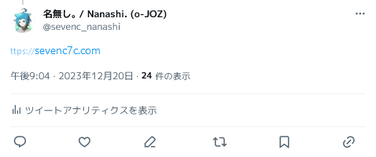

# Xttps / Make ttps:// links clickable in Twitter (or X)

**English** / [日本語](./README.ja.md)



This extension makes `ttps://` links clickable in Twitter.
This is useful when you want to avoid X's "Tombstone" blocker.

## Installation

### via Tampermonkey (for Most Browsers)

1. Install [Tampermonkey](https://www.tampermonkey.net/) to your browser.
2. Open [xttps.user.js](https://raw.githubusercontent.com/sevenc-nanashi/xttps/release/xttps.user.js).
3. Click `Install` button.

Alternatively, you can add the script via URL in Tampermonkey dashboard (Utilities > Install from URL):
```
https://raw.githubusercontent.com/sevenc-nanashi/xttps/release/xttps.user.js
```

### via Userscripts (for Safari)

1. Install [Userscripts](https://itunes.apple.com/us/app/userscripts/id1463298887) to your Safari.
2. Open [xttps.user.js](https://github.com/sevenc-nanashi/xttps/raw/release/xttps.user.js).
3. Click or Tap `</>` icon (or `AA` > `</> Userscripts`).
4. Click or Tap `Userscript detected. Click (Tap) to Install.`

### via Chrome Web Store (for Chrome, Edge, etc.)

TODO. Waiting for review.

### via Firefox Add-ons (for Firefox)

The add-on is available at <https://addons.mozilla.org/ja/firefox/addon/xttps/>.

## Development

### Requirements

- [pnpm](https://pnpm.io/)
- [Node.js](https://nodejs.org/) (v18)

```
# Live re-build
pnpm dev

# Build zip
pnpm build
```

## License

This extension is licensed under the MIT License. See [LICENSE](LICENSE) for details.
